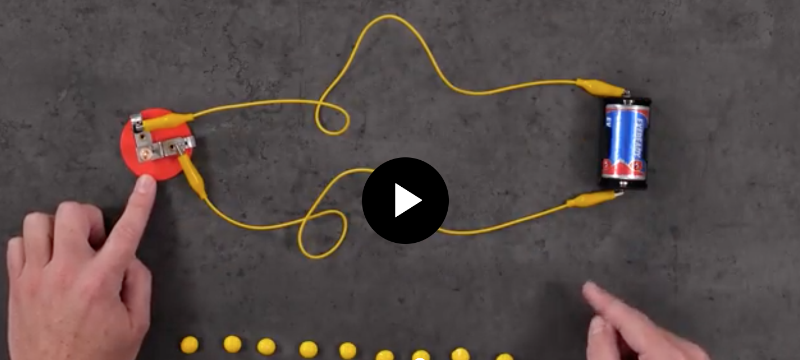
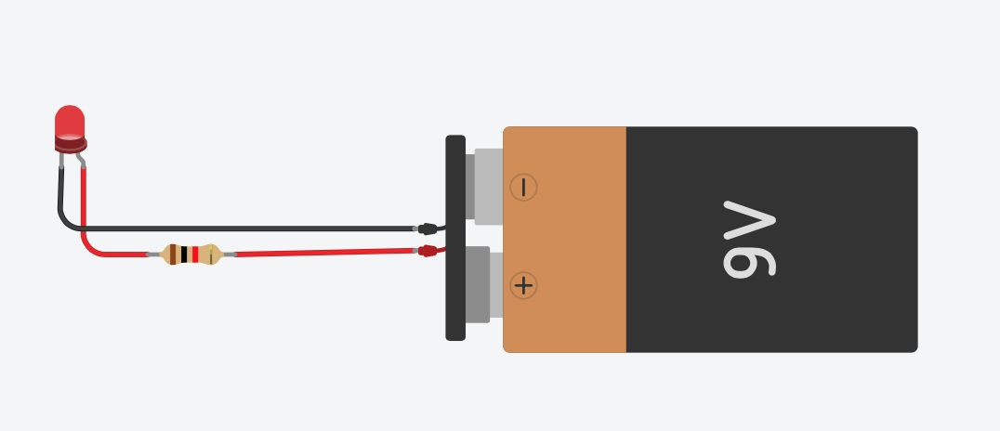
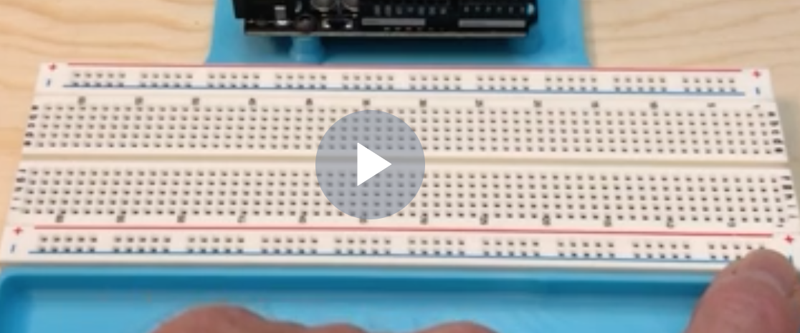
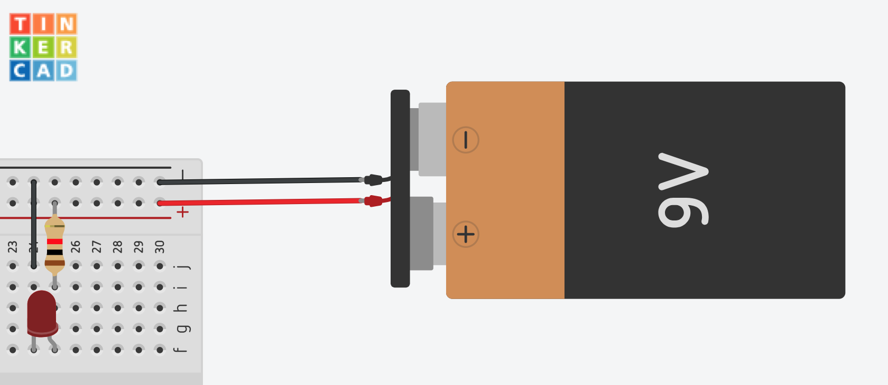
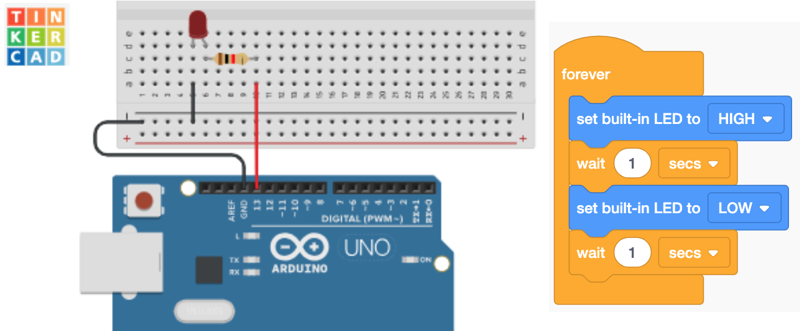
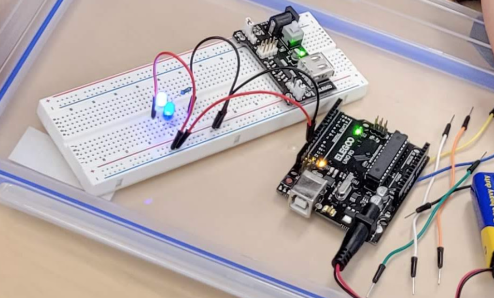
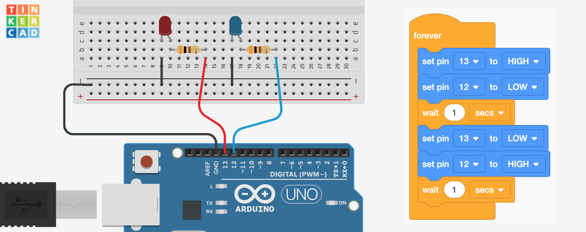
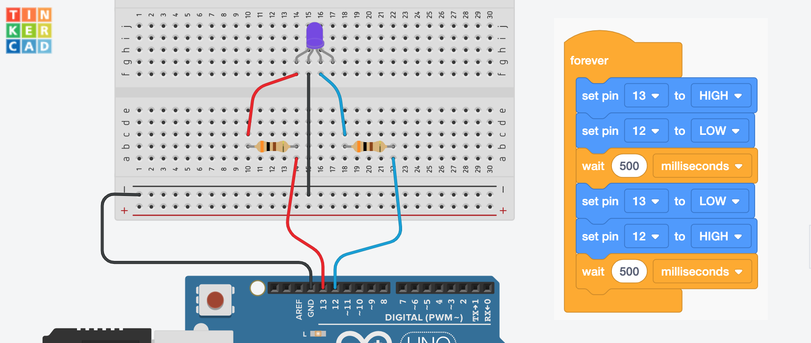

---

# 
# 
Welcome to AZIA Robotics!

---

# Lesson 1 - Your first cicruit!

## Activity 1.1: What is electricity

## Activity 1.2: Join Tinkercad

### To join, [click here](https://www.tinkercad.com/joinclass/ALD5WBV3J) or go to [Tinkercad.com](https://www.tinkercad.com/) and use class code: **ALD 5WB V3J** 

## Activity 1.3: Build a circuit: LED Light Up

---

# Lesson 2 - Breadboards

## Activity 2.1 What is a breadboard?

## Activity 2.2: Rebuild your circuit using a breadboard.

## Activity 2.3: Your first electronics board!

---

# Lesson 3 - Arduino UNO
The Arduino Uno is an open-source microcontroller board.

## Activity 3.1: Blinking LED

## Activity 3.2: Time to build

---

# Lesson 4 - Arduino UNO
The Arduino Uno is an open-source microcontroller board.

## Activity 4.1: Police Lights

## Activity 4.1: Police Light

