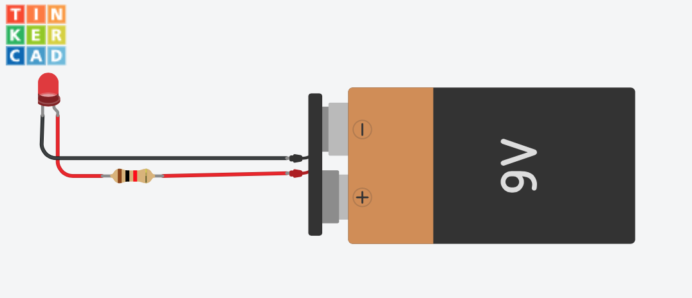

# Welcome to AZIA Robotics!

## Lesson 1 - Your first cicruit!

### Activity 1.1: What is electricity

<video width="320" controls>
  <source src="media/WhatIsElectricity.mp4" type="video/mp4">
</video>

### Activity 1.2: Join Tinkercad

To join, either go to [Tinkercad.com](https://www.tinkercad.com/) and use class code: **ALD5WBV3J** 

or click [here](https://www.tinkercad.com/joinclass/ALD5WBV3J).

### Activity 1.3: Build your first circuit: LED Light Up

## Lesson 2 - Breadboards

### Activity 2.1 What is a breadboard?

[What is a breadboard?](https://safeshare.tv/x/ss670ee6f978725)

### Activity 2.2: Rebuild your circuit using a breadboard.

### Activity 2.3: Time to build a real one!

